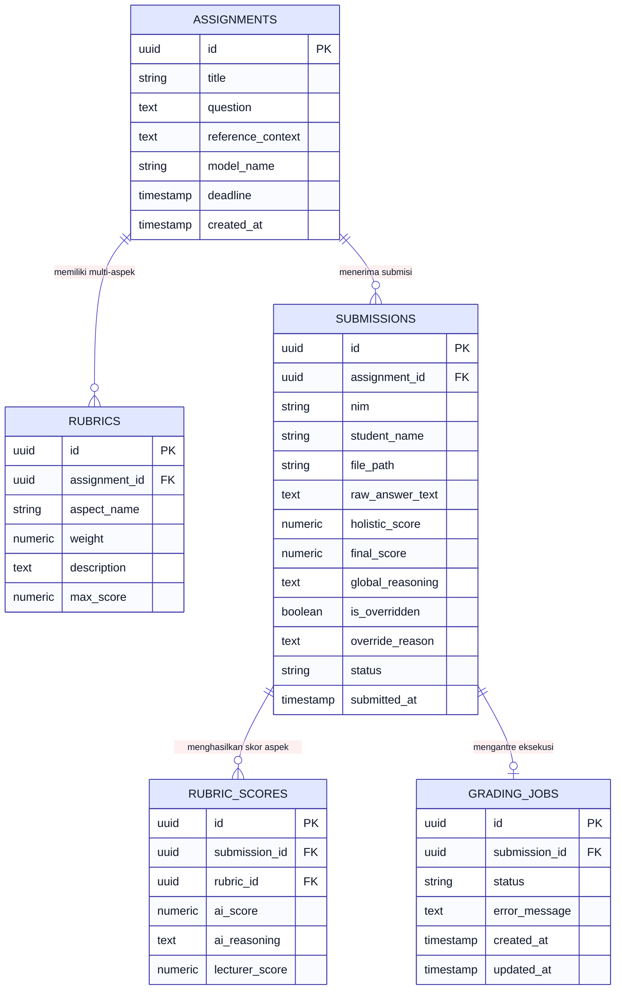

# 🗄️ REVISI BAB III: ENTITY RELATIONSHIP DIAGRAM (ERD) SUPABASE

**File Target:** `docs/06_revisi_sidang_akhir/02_ERD_DATABASE_SUPABASE_BAB3.md`  
**Topik:** Perancangan Basis Data Relasional Supabase (BaaS)  
**Catatan Penguji:** *"ERD belum ada (yang di Supabase) BAB 3."*  
**Update Styling:** Font Mermaid diperbesar (`fontSize: 18px-20px`, *high contrast styling* agar jelas saat di-export ke PNG).

---

```markdown
================================================================================
[SIAP COPY-PASTE SKRIPSI] - BAB III SUB-BAB 3.3.3 ENTITY RELATIONSHIP DIAGRAM
================================================================================

3.3.3. Perancangan Basis Data (Entity Relationship Diagram - Supabase)

Sistem Smart Assistant Lecturer (SAL) menggunakan basis data relasional PostgreSQL yang dikelola melalui Supabase Backend-as-a-Service (BaaS). Perancangan basis data dirancang untuk mendukung tiga alur kerja utama: (1) Pengelolaan parameter tugas dosen dan materi acuan Knowledge Grounding, (2) Pengelolaan berkas jawaban digital mahasiswa dan ekstraksi teks murni, serta (3) Pengelolaan log evaluasi Chain-of-Thought (CoT) AI, skor parsial rubrik, dan riwayat override nilai oleh dosen.

Struktur hubungan antar-entitas basis data disajikan melalui Entity Relationship Diagram (ERD) pada Gambar 3.x (Teks dan elemen ERD telah dioptimasi dengan font HD 18px agar tetap tajam dan jelas saat diekspor ke gambar PNG):



Tabel 3.x Spesifikasi Atribut dan Kamus Data Supabase:

1. Tabel assignments (Data Utama Tugas Dosen)
   - id (UUID, Primary Key): Identifikasi unik tugas.
   - title (VARCHAR(100)): Judul tugas esai / praktikum.
   - question (TEXT): Naskah soal esai atau instruksi instruktur.
   - reference_context (TEXT): Konteks acuan Knowledge Grounding (kunci jawaban & modul dosen).
   - model_name (VARCHAR(50)): Model LLM yang digunakan (contoh: openai/gpt-oss-120b).
   - created_at (TIMESTAMP): Timestamp pembuatan tugas.

2. Tabel rubrics (Data Rubrik Penilaian Dosen)
   - id (UUID, Primary Key): Identifikasi unik aspek rubrik.
   - assignment_id (UUID, Foreign Key -> assignments.id): Relasi ke tugas terkait.
   - aspect_name (VARCHAR(100)): Nama aspek penilaian (misal: "Pembuatan Tabel & Primary Key").
   - weight (NUMERIC(5,2)): Bobot persentase aspek (misal: 10.00 untuk 10%).
   - description (TEXT): Deskripsi indikator penilaian (Kriteria 0, 50, 100).
   - max_score (NUMERIC(5,2)): Skor maksimal aspek (default: 100.00).

3. Tabel submissions (Data Submisi Mahasiswa & Hasil Penilaian)
   - id (UUID, Primary Key): Identifikasi unik dokumen submisi.
   - assignment_id (UUID, Foreign Key -> assignments.id): Relasi ke tugas.
   - nim (VARCHAR(20)): Nomor Induk Mahasiswa.
   - student_name (VARCHAR(100)): Nama lengkap mahasiswa.
   - file_path (VARCHAR(255)): Path lokasi berkas di Supabase Storage.
   - raw_answer_text (TEXT): Teks murni hasil ekstraksi & cleansing regex middleware.
   - holistic_score (NUMERIC(5,2)): Total skor terbobot yang dihitung oleh AI.
   - final_score (NUMERIC(5,2)): Nilai akhir resmi (skor AI atau skor hasil override dosen).
   - global_reasoning (TEXT): Log penalaran Chain-of-Thought (CoT) holistik dari AI.
   - is_overridden (BOOLEAN): Indikator apakah nilai telah dikoreksi manual oleh dosen (true/false).
   - override_reason (TEXT): Catatan penjelas dari dosen saat melakukan override nilai.
   - status (VARCHAR(30)): Status alur kerja (pending, grading, graded, validated).
   - submitted_at (TIMESTAMP): Waktu mahasiswa mengunggah jawaban.

4. Tabel rubric_scores (Data Skor Parsial per Aspek Rubrik)
   - id (UUID, Primary Key): Identifikasi unik rincian skor aspek.
   - submission_id (UUID, Foreign Key -> submissions.id): Relasi ke dokumen submisi.
   - rubric_id (UUID, Foreign Key -> rubrics.id): Relasi ke aspek rubrik.
   - ai_score (NUMERIC(5,2)): Skor parsial hasil inferensi AI (0, 50, atau 100).
   - ai_reasoning (TEXT): Justifikasi penalaran CoT spesifik untuk aspek tersebut.
   - lecturer_score (NUMERIC(5,2)): Skor revisi manual dosen (jika ada override).

5. Tabel grading_jobs (Data Antrean Pekerjaan Inferensi Asynchronous)
   - id (UUID, Primary Key): Identifikasi unik pekerjaan antrean.
   - submission_id (UUID, Foreign Key -> submissions.id): Relasi ke submisi.
   - status (VARCHAR(20)): Status eksekusi (queued, processing, completed, failed).
   - error_message (TEXT): Pesan kesalahan jika inferensi gagal.
   - created_at / updated_at (TIMESTAMP): Waktu antrean.

Perancangan kardinalitas basis data Supabase meliputi relasi 1 to Many (1:N) dari assignments ke rubrics, relasi 1 to Many (1:N) dari assignments ke submissions, relasi 1 to Many (1:N) dari submissions ke rubric_scores, serta relasi 1 to 1 (1:1) dari submissions ke grading_jobs.

================================================================================
```
