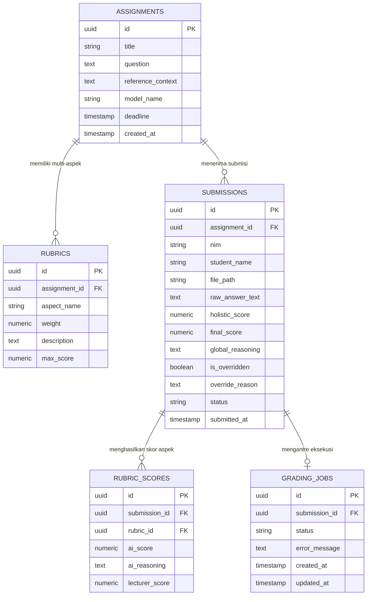

# 🗄️ REVISI BAB III: ENTITY RELATIONSHIP DIAGRAM (ERD) SUPABASE

**File Target:** `docs/06_revisi_sidang_akhir/02_ERD_DATABASE_SUPABASE_BAB3.md`  
**Topik:** Perancangan Basis Data Relasional Supabase (BaaS)  
**Catatan Penguji:** *"ERD belum ada (yang di Supabase) BAB 3."*

---

## 📌 DESKRIPSI PERANCANGAN BASIS DATA

Sistem *Smart Assistant Lecturer* (SAL) menggunakan basis data relasional PostgreSQL yang dikelola melalui **Supabase Backend-as-a-Service (BaaS)**. Perancangan basis data dirancang untuk mendukung tiga alur kerja utama:
1. **Pengelolaan Parameter Dosen:** Menyimpan metadata tugas (`assignments`), rubrik penilaian berbobot (`rubrics`), serta dokumen acuan *Knowledge Grounding*.
2. **Pengelolaan Submisi Mahasiswa:** Menyimpan berkas jawaban digital mahasiswa (`submissions`), hasil ekstraksi teks murni, dan status proses penilaian.
3. **Log Evaluasi & Override AI:** Menyimpan skor parsial per aspek (`rubric_scores`), log penalaran *Chain-of-Thought* (CoT), hasil override nilai manual oleh dosen, serta antrean tugas *asynchronous* (`grading_jobs`).

---

## 📊 MERMAID DIAGRAM: ENTITY RELATIONSHIP DIAGRAM (ERD)

---

## 📋 SPESIFIKASI ATRIBUT DAN KAMUS DATA (TABLE SCHEMAS)

### 1. Tabel `assignments` (Data Tugas Dosen)
*Menyimpan informasi tugas esai, instruksi, dan materi referensi grounding.*
- `id` (UUID, Primary Key): Identifikasi unik tugas.
- `title` (VARCHAR(100)): Judul tugas esai / praktikum.
- `question` (TEXT): Naskah soal esai atau instruksi instruktur.
- `reference_context` (TEXT): Konteks acuan *Knowledge Grounding* (kunci jawaban & modul dosen).
- `model_name` (VARCHAR(50)): Model LLM yang digunakan (contoh: `openai/gpt-oss-120b`).
- `created_at` (TIMESTAMP): Waktu pembuatan tugas.

### 2. Tabel `rubrics` (Data Rubrik Penilaian Dosen)
*Menyimpan rincian kriteria dan bobot aspek penilaian terstruktur.*
- `id` (UUID, Primary Key): Identifikasi unik aspek rubrik.
- `assignment_id` (UUID, Foreign Key $\rightarrow$ `assignments.id`): Relasi ke tugas terkait.
- `aspect_name` (VARCHAR(100)): Nama aspek penilaian (misal: "Pembuatan Tabel & Primary Key").
- `weight` (NUMERIC(5,2)): Bobot persentase aspek (misal: `10.00` untuk 10%).
- `description` (TEXT): Deskripsi indikator penilaian (Kriteria 0, 50, 100).
- `max_score` (NUMERIC(5,2)): Skor maksimal aspek (default: `100.00`).

### 3. Tabel `submissions` (Data Submisi Mahasiswa & Hasil Penilaian)
*Menyimpan berkas jawaban mahasiswa, hasil evaluasi AI, dan validasi dosen.*
- `id` (UUID, Primary Key): Identifikasi unik dokumen submisi.
- `assignment_id` (UUID, Foreign Key $\rightarrow$ `assignments.id`): Relasi ke tugas.
- `nim` (VARCHAR(20)): Nomor Induk Mahasiswa.
- `student_name` (VARCHAR(100)): Nama lengkap mahasiswa.
- `file_path` (VARCHAR(255)): Path lokasi berkas di Supabase Storage (`student-submissions/`).
- `raw_answer_text` (TEXT): Teks murni hasil ekstraksi & *cleansing* regex middleware.
- `holistic_score` (NUMERIC(5,2)): Total skor terbobot yang dihitung oleh AI.
- `final_score` (NUMERIC(5,2)): Nilai akhir resmi (skor AI atau skor hasil *override* dosen).
- `global_reasoning` (TEXT): Log penalaran *Chain-of-Thought* (CoT) holistik dari AI.
- `is_overridden` (BOOLEAN): Indikator apakah nilai telah dikoreksi manual oleh dosen (`true`/`false`).
- `override_reason` (TEXT): Catatan penjelas dari dosen saat melakukan *override* nilai.
- `status` (VARCHAR(30)): Status alur kerja (`pending`, `grading`, `graded`, `validated`).
- `submitted_at` (TIMESTAMP): Waktu mahasiswa mengunggah jawaban.

### 4. Tabel `rubric_scores` (Data Skor Parsial per Aspek Rubrik)
*Menyimpan Rincian Skor dan Justifikasi CoT per Aspek Rubrik.*
- `id` (UUID, Primary Key): Identifikasi unik rincian skor aspek.
- `submission_id` (UUID, Foreign Key $\rightarrow$ `submissions.id`): Relasi ke dokumen submisi.
- `rubric_id` (UUID, Foreign Key $\rightarrow$ `rubrics.id`): Relasi ke aspek rubrik.
- `ai_score` (NUMERIC(5,2)): Skor parsial hasil inferensi AI (0, 50, atau 100).
- `ai_reasoning` (TEXT): Justifikasi penalaran CoT spesifik untuk aspek tersebut.
- `lecturer_score` (NUMERIC(5,2)): Skor revisi manual dosen (jika ada override).

### 5. Tabel `grading_jobs` (Data Antrean Pekerjaan Inferensi Asynchronous)
*Mengelola status eksekusi antrean inferensi AI.*
- `id` (UUID, Primary Key): Identifikasi unik pekerjaan.
- `submission_id` (UUID, Foreign Key $\rightarrow$ `submissions.id`): Relasi ke submisi.
- `status` (VARCHAR(20)): Status eksekusi (`queued`, `processing`, `completed`, `failed`).
- `error_message` (TEXT): Rincian pesan kesalahan jika inferensi mengalami kegagalan.
- `created_at` / `updated_at` (TIMESTAMP): Timestamp pelacakan waktu antrean.

---

## 🔗 KELENGKAPAN RELASI DAN KARDINALITAS (RELATIONSHIPS)
1. **`assignments` ke `rubrics` (1 to Many / $1 : N$):**  
   Satu tugas dosen dapat memiliki banyak aspek rubrik penilaian (contoh: 10 aspek operasi SQL).
2. **`assignments` ke `submissions` (1 to Many / $1 : N$):**  
   Satu tugas dapat disubmit oleh banyak mahasiswa.
3. **`submissions` ke `rubric_scores` (1 to Many / $1 : N$):**  
   Satu lembar submisi mahasiswa menghasilkan rincian skor pada $N$ aspek rubrik.
4. **`submissions` ke `grading_jobs` (1 to 1 / $1 : 1$):**  
   Setiap lembar submisi memiliki 1 entri pelacakan antrean proses inferensi AI.
