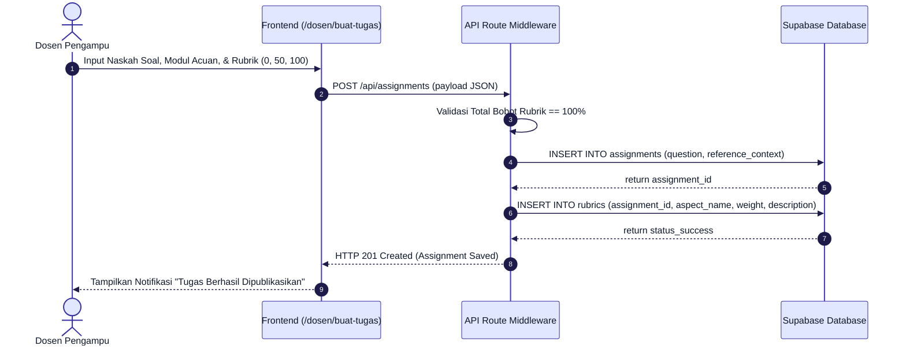
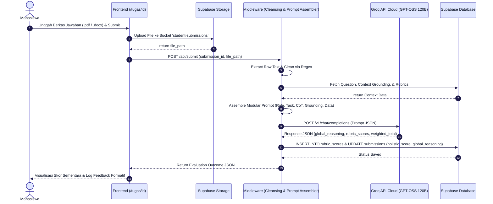
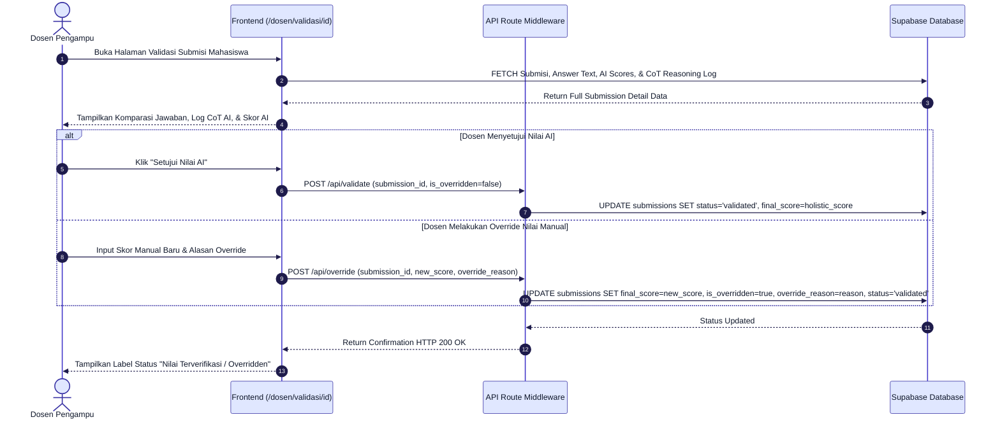

# 📐 REVISI BAB III: USE CASE & 3 SEQUENCE DIAGRAMS TERPISAH

**File Target:** `docs/06_revisi_sidang_akhir/03_UML_USECASE_DAN_3_SEQUENCE_DIAGRAMS_BAB3.md`  
**Topik:** Pemodelan UML, Use Case Diagram Halaman, dan 3 Sequence Diagrams Terpisah  
**Catatan Penguji:**  
1. *"Use Case Diagram harus sesuai urutan alur kerja di setiap page dosen dan mahasiswa."*  
2. *"Sequence Diagram masih kurang, harus nyampe ke dosen yang override nilai. Dibikin 3 sequence terpisah: Dosen, Mahasiswa, lalu Dosen lagi."*  
**Update Layout:** Tata letak Use Case Diagram disempurnakan mengikut standar baku UML (Aktor Dosen di sebelah KIRI sebagai Primary Actor, Aktor Mahasiswa di sebelah KANAN sebagai Secondary Actor, dan System Boundary di TENGAH).

---

```markdown
================================================================================
[SIAP COPY-PASTE SKRIPSI] - BAB III SUB-BAB 3.3.1 USE CASE DIAGRAM BERBASIS RUTE HALAMAN
================================================================================

3.3.1. Perancangan Use Case Diagram

Perancangan Use Case Diagram disesuaikan secara presisi dengan arsitektur antarmuka dan alur kerja pengguna pada setiap rute halaman aplikasi Smart Assistant Lecturer (SAL). Aktor utama dalam sistem ini terbagi menjadi dua: Dosen Pengampu sebagai Primary Actor (Evaluator/Administrator) di sebelah kiri, dan Mahasiswa sebagai Secondary Actor di sebelah kanan.

Pengelompokan Use Case berdasarkan rute halaman aplikasi direpresentasikan sebagai berikut:

1. Aktor Dosen Pengampu (Primary Actor - Sisi Kiri):
   a. Halaman /dosen/buat-tugas: Dosen menginput naskah soal esai, mengunggah dokumen referensi acuan Knowledge Grounding, dan menguraikan kriteria rubrik 3-Point Partial Credit.
   b. Halaman /dosen: Dosen memantau dashboard rekapitulasi nilai, status pemeriksaan, dan daftar submisi mahasiswa.
   c. Halaman /dosen/validasi/[id]: Dosen mengulas (review) log penalaran Chain-of-Thought (CoT) AI, melakukan koreksi/override nilai manual, serta memfinalisasi status nilai.

2. Aktor Mahasiswa (Secondary Actor - Sisi Kanan):
   a. Halaman /tugas/[id]: Mahasiswa mengunggah berkas dokumen jawaban (.pdf, .docx, .txt).
   b. Halaman /tugas/[id]: Mahasiswa melihat visualisasi skor sementara dan rincian umpan balik formatif per aspek secara responsif.

Diagram Use Case disajikan pada Gambar 3.x (Tata letak mengadopsi standar baku UML: Aktor Kiri = Dosen, Batas Sistem di Tengah, Aktor Kanan = Mahasiswa):

```mermaid
%%{init: {
  'theme': 'base',
  'themeVariables': {
    'fontFamily': 'Arial, sans-serif',
    'fontSize': '18px',
    'primaryColor': '#e0e7ff',
    'primaryTextColor': '#0f172a',
    'primaryBorderColor': '#3730a3',
    'lineColor': '#4338ca',
    'clusterBkg': '#f8fafc',
    'clusterBorder': '#64748b'
  }
}}%%
flowchart LR
    Dosen(("👨‍🏫 Dosen Pengampu<br/>(Primary Actor)"))

    subgraph SystemBoundary["Boundaries System: Smart Assistant Lecturer (SAL)"]
        subgraph DosenPages["Portal Dosen"]
            UC1["Buat Tugas & Grounding Context<br/>(/dosen/buat-tugas)"]
            UC2["Kelola Rubrik 3-Point Partial Credit<br/>(/dosen/buat-tugas)"]
            UC3["Lihat Dashboard Rekap Submisi<br/>(/dosen)"]
            UC4["Review Log Justifikasi CoT AI<br/>(/dosen/validasi/id)"]
            UC5["Koreksi / Override Nilai Manual<br/>(/dosen/validasi/id)"]
        end

        subgraph StudentPages["Portal Mahasiswa"]
            UC6["Unggah Berkas Jawaban<br/>(/tugas/id)"]
            UC7["Lihat Feedback Formatif & Skor<br/>(/tugas/id)"]
        end
    end

    Mahasiswa(("👨‍🎓 Mahasiswa<br/>(Secondary Actor)"))

    Dosen --> UC1
    Dosen --> UC2
    Dosen --> UC3
    Dosen --> UC4
    Dosen --> UC5

    UC6 <-- Mahasiswa
    UC7 <-- Mahasiswa
```

================================================================================
```

---

```markdown
================================================================================
[SIAP COPY-PASTE SKRIPSI] - BAB III SUB-BAB 3.3.2 THREE-STAGE SEQUENCE DIAGRAMS
================================================================================

3.3.2. Perancangan Sequence Diagram (Tiga Tahapan Terpisah)

Guna memberikan gambaran eksplisit mengenai interaksi antar-komponen aplikasi, lapisan middleware, basis data Supabase, dan layanan Groq API Cloud, perancangan Sequence Diagram dibagi menjadi 3 tahapan sekuensial terpisah (seluruh diagram dioptimasi dengan font aktor & pesan 18px agar jelas saat diekspor ke gambar):

1. Sequence Diagram 1: Tahap Pembuatan Tugas dan Grounding Dosen (/dosen/buat-tugas)
Sequence diagram pertama menggambarkan alur kerja Dosen Pengampu saat menerbitkan tugas baru, mengunggah konteks acuan Knowledge Grounding, dan menyimpan kriteria rubrik 3-Point Partial Credit ke basis data Supabase.



2. Sequence Diagram 2: Tahap Submisi Mahasiswa dan Pipeline Evaluasi AI Engine (/tugas/[id])
Sequence diagram kedua menggambarkan alur kerja Mahasiswa saat mengunggah berkas jawaban, dilanjutkan dengan eksekusi pipeline middleware (cleansing teks regex, perakitan prompt modular), inferensi ke Groq API Cloud (model GPT-OSS 120B), komputasi skor terbobot, hingga penyimpanan log justifikasi CoT ke Supabase.



3. Sequence Diagram 3: Tahap Validasi, Review CoT, dan Override Nilai Manual Dosen (/dosen/validasi/[id])
Sequence diagram ketiga menggambarkan alur kerja Dosen Pengampu saat membuka halaman validasi untuk meninjau log penalaran CoT AI. Apabila terdapat ketidaksesuaian penilaian, Dosen dapat melakukan override nilai secara manual dan menyimpan catatan justifikasi resmi ke basis data Supabase.



================================================================================
```
