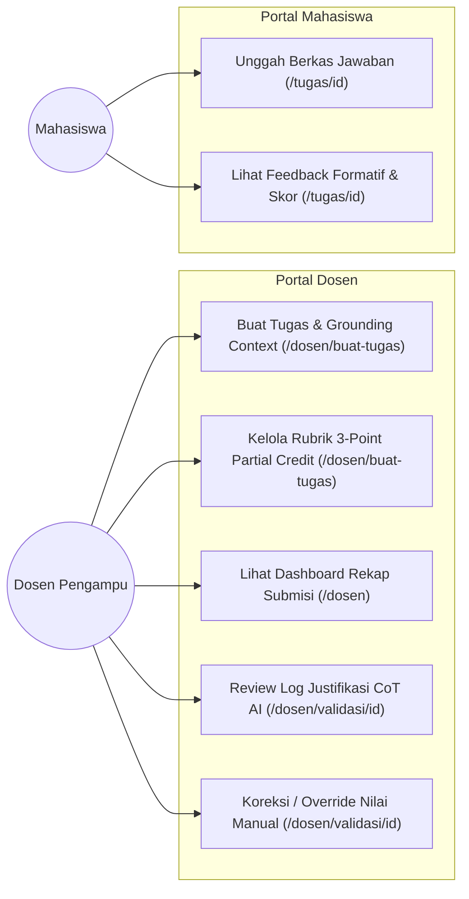
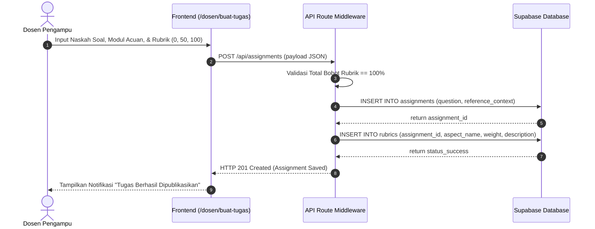
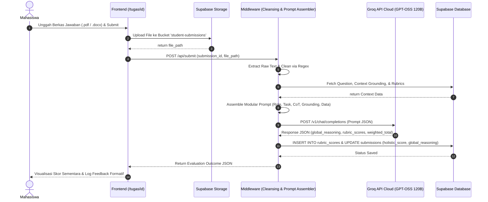
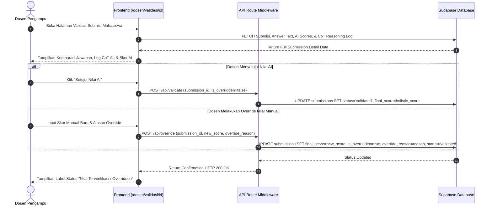

# 📐 REVISI BAB III: USE CASE & 3 SEQUENCE DIAGRAMS TERPISAH

**File Target:** `docs/06_revisi_sidang_akhir/03_UML_USECASE_DAN_3_SEQUENCE_DIAGRAMS_BAB3.md`  
**Topik:** Pemodelan UML, Use Case Diagram Halaman, dan 3 Sequence Diagrams Terpisah  
**Catatan Penguji:**  
1. *"Use Case Diagram harus sesuai urutan alur kerja di setiap page dosen dan mahasiswa."*  
2. *"Sequence Diagram masih kurang, harus nyampe ke dosen yang override nilai. Dibikin 3 sequence terpisah: Dosen, Mahasiswa, lalu Dosen lagi."*

---

## 📍 1. USE CASE DIAGRAM BERBASIS HALAMAN SISTEM

### Pemetaan Halaman Aplikasi & Aktor:
- **Aktor Dosen:**
  - Halaman `/dosen/buat-tugas`: Membuat tugas, mengunggah materi referensi *Knowledge Grounding*, menetapkan bobot rubrik.
  - Halaman `/dosen`: Memantau *dashboard* rekapitulasi nilai dan status pemeriksaan.
  - Halaman `/dosen/validasi/[id]`: Meninjau log penalaran CoT AI, melakukan *override* nilai manual, serta memfinalisasi status nilai.
- **Aktor Mahasiswa:**
  - Halaman `/tugas/[id]`: Mengunggah berkas jawaban (.pdf, .docx, .txt), memicu eksekusi *pipeline* AI middleware, dan melihat umpan balik formatif *real-time*.

### Mermaid Diagram: Use Case System SAL

---

## 🔄 2. SEQUENCE DIAGRAM TERPISAH 1: DOSEN (PEMBUATAN TUGAS & GROUNDING)

*Fokus: Alur Dosen membuat instrumen soal, mengunggah materi acuan grounding, dan mengunci kriteria rubrik di Supabase.*

---

## 🔄 3. SEQUENCE DIAGRAM TERPISAH 2: MAHASISWA (SUBMISI & PIPELINE EVALUASI AI)

*Fokus: Alur Mahasiswa mengunggah jawaban, eksekusi ekstraksi teks middleware, inferensi Groq LLM (GPT-OSS 120B), komputasi skor, dan penyampaian feedback.*

---

## 🔄 4. SEQUENCE DIAGRAM TERPISAH 3: DOSEN (VALIDASI, REVIEW COT, & OVERRIDE NILAI)

*Fokus: Alur Dosen meninjau hasil AI, mengevaluasi justifikasi CoT, melakukan koreksi/override nilai manual jika diperlukan, dan memfinalisasi nilai resmi.*

---

## 📌 PENJELASAN INTEGRASI DIAGRAM UNTUK NASKAH SKRIPSI
1. **Pemisahan 3 Sequence Diagram** memberikan kejelasan arsitektur yang sangat tinggi. Penguji dapat melihat dengan jelas batasan antara tahap *authoring* (Dosen), tahap *automated inference* (Mahasiswa & AI Engine), serta tahap *human-in-the-loop control* (Validasi & Override Dosen).
2. **Override Mechanism** pada Diagram 3 membuktikan secara eksplisit bahwa otoritas penilaian akademik tetap 100% berada di tangan dosen pengampu, sehingga menjawab rumusan masalah mengenai kendali kaku rubrik dosen.
