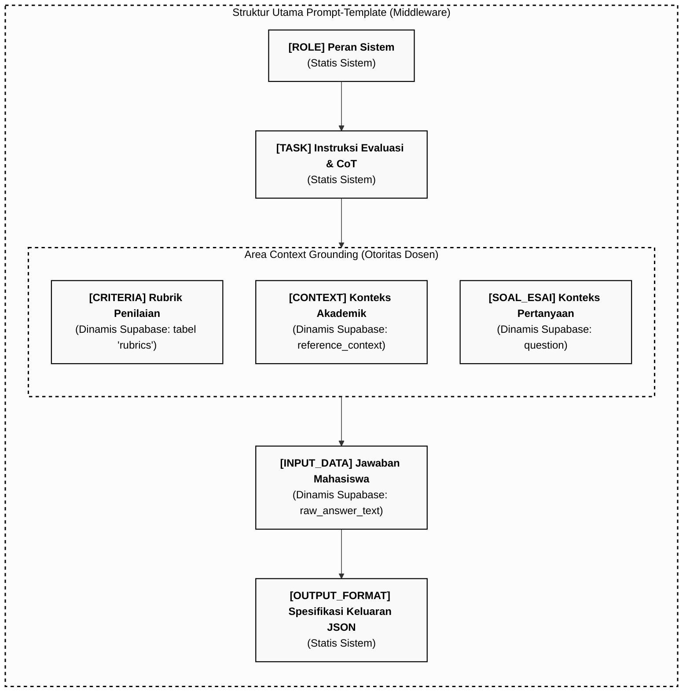

# Dokumentasi Struktur Prompt Modular (Middleware SAL)

Dokumen ini menjelaskan rancangan, pemetaan kode, dan aliran perakitan prompt modular pada sistem **Smart Assistant Lecturer (SAL)** untuk kebutuhan penulisan naskah Skripsi Bab III (Metodologi/Perancangan) dan Bab IV (Hasil Pembahasan).

---

## 1. Lokasi Implementasi Kode Program

Mekanisme perakitan prompt modular (penggabungan parameter statis sistem dan parameter dinamis/otoritas dosen) sepenuhnya diimplementasikan pada berkas:
👉 **[`src/lib/grading/prompt-composer.ts`](file:///home/alexa/Documents/SKRIPSI/project/sal/src/lib/grading/prompt-composer.ts)**

Fungsi utama yang merakit prompt ini adalah `composeGradingPrompt(input: ComposePromptInput): string` yang dipanggil oleh API grading utama di:
👉 **[`src/app/api/grade/route.ts`](file:///home/alexa/Documents/SKRIPSI/project/sal/src/app/api/grade/route.ts)**

---

## 2. Visualisasi Aliran Perakitan Prompt (Mermaid Diagram)

Berikut adalah diagram alir perakitan komponen prompt dinamis melalui middleware SAL sebelum dikirimkan ke model AI (Groq API inference):



---

## 3. Komponen Struktur Prompt Modular

Secara struktural, prompt dipecah menjadi dua bagian utama: **Parameter Statis Sistem** (otoritas sistem) dan **Parameter Dinamis** (otoritas dosen & data mahasiswa).

### A. Parameter Statis (Sistem)
Bagian ini didefinisikan secara konstan dalam kode program untuk memastikan AI bertindak sebagai asisten dosen yang objektif dan menggunakan metode berpikir terstruktur (*Chain-of-Thought*):
1. **`[ROLE]`**: Menetapkan peran AI sebagai asisten dosen cerdas yang ketat namun adil untuk penilaian esai dan sintaks kode SQL/algoritma.
2. **`[TASK]`**: Instruksi pengerjaan berbasis *Chain-of-Thought (CoT)* untuk membandingkan jawaban mahasiswa dengan grounding, menghitung nilai per kriteria kaku, dan merumuskan umpan balik dalam Bahasa Indonesia.
3. **`[OUTPUT_FORMAT]`**: Skema JSON kaku untuk memastikan hasil keluaran model dapat diparsing secara otomatis oleh middleware dan langsung dipetakan ke tabel database Supabase tanpa distorsi.

### B. Parameter Dinamis & Context Grounding (Otoritas Dosen)
Bagian ini diisi secara dinamis melalui data yang diinput oleh Dosen di UI `/buat-tugas` dan disimpan ke Supabase:
1. **`[CRITERIA] Rubrik Penilaian`**: Data kriteria (Nama Aspek, Bobot %, Deskripsi Detail) yang diambil dari tabel `rubrics`.
2. **`[CONTEXT] Konteks Akademik / Materi Referensi`**: Kunci jawaban detail, aturan toleransi sintaks (sintaks alternatif yang diizinkan), skema database, atau materi rujukan dari kolom `reference_context` tabel `assignments`.
3. **`[SOAL_ESAI] Soal Ujian`**: Pertanyaan praktikum dari kolom `question` tabel `assignments`.
4. **`[INPUT_DATA] Jawaban Mahasiswa`**: Teks jawaban yang dikumpulkan mahasiswa dari kolom `raw_answer_text` tabel `submissions`.

---

## 4. Contoh Perakitan Prompt Riil (Template Database Existing)

Ketika dosen memuat template bawaan praktikum di menu `/buat-tugas` (DBMS & SQL), berikut adalah bagaimana middleware SAL merakit string prompt lengkap sebelum dikirim ke Groq API:

```markdown
### [ROLE]
You are a strict but fair smart assistant lecturer (asisten dosen cerdas) for essay and pseudocode grading.

### [TASK]
Evaluate the student's answer using a step-by-step Chain-of-Thought (CoT) strategy:
1. Analyze the student's answer logic relative to the essay question, the provided rubrics, and the reference material.
2. Compare the logic of the student's answer with the context grounding. Note any discrepancies, omissions, or errors.
3. Reason about each specific grading aspect in the rubrics and assign scores strictly on a 0-100 scale.
4. Determine the overall holistic score and provide feedback based on this step-by-step reasoning.

### Area Context Grounding (Lecturer Authority)
#### [CRITERIA] Rubrik Penilaian:
1. Aspect: Penerapan CREATE DATABASE
   Weight: 10%
   Criteria: Kebenaran sintaks pembuatan database 'universitas' dengan benar tanpa error.

2. Aspect: Penerapan CREATE TABLE
   Weight: 10%
   Criteria: Kebenaran sintaks pembuatan tabel 'mahasiswa' lengkap dengan Primary Key (nim) dan tipe data yang relevan.

3. Aspect: Penerapan INSERT DATA
   Weight: 10%
   Criteria: Kebenaran penulisan query untuk memasukkan ketiga baris data mahasiswa secara lengkap.

4. Aspect: Penerapan SELECT / READ DATA
   Weight: 30%
   Criteria: Kebenaran logika dan sintaks dari ketiga query pemanggilan data (tampil semua, filter jurusan, dan filter IPK).

5. Aspect: Penerapan UPDATE DATA
   Weight: 10%
   Criteria: Kebenaran query perubahan IPK mahasiswa dengan NIM '12346' menjadi 3.8.

6. Aspect: Penerapan DELETE DATA
   Weight: 10%
   Criteria: Kebenaran query penghapusan baris data mahasiswa atas nama 'Citra Dewi' (diperbolehkan menggunakan filter nim = '12347' atau nama = 'Citra Dewi').

7. Aspect: Penerapan ALTER TABLE
   Weight: 20%
   Criteria: Kebenaran query modifikasi struktur tabel (ALTER ADD) dan pembaruan kolom baru tersebut.

#### [CONTEXT] Konteks Akademik / Materi Referensi:
DOKUMEN ACUAN DAN PANDUAN TOLERANSI VARIASI (GROUND TRUTH):

1. PEMBUATAN DATABASE
Sintaks Standar: CREATE DATABASE universitas;
Aturan Toleransi:
- Case-insensitivity dibebaskan (CREATE DATABASE / create database / Create Database).
- Penggunaan karakter titik koma (;) di akhir query bersifat opsional.

2. PEMBUATAN TABEL
Sintaks Standar: 
CREATE TABLE mahasiswa (
  nim VARCHAR(10) PRIMARY KEY,
  nama VARCHAR(100),
  jurusan VARCHAR(50),
  angkatan YEAR,
  ipk DECIMAL(3,2)
);
Aturan Toleransi:
- Ukuran VARCHAR dibebaskan.
- Presisi DECIMAL dibebaskan, atau boleh menggunakan FLOAT/DOUBLE.
- Kolom angkatan boleh menggunakan tipe data YEAR, INT, atau INTEGER.
... [dan seterusnya sesuai isi Kunci Jawaban & Modul Referensi di database]

#### [SOAL_ESAI] Soal Ujian:
Tuliskan perintah SQL untuk menyelesaikan seluruh latihan berikut secara berurutan:
1. Membuat Database: Buat database baru bernama 'universitas'... [dan seterusnya]

### [INPUT_DATA] Jawaban Mahasiswa:
[Teks sintaks SQL jawaban mahasiswa yang sedang diperiksa]

### [OUTPUT_FORMAT]
You MUST respond ONLY with a valid JSON object matching the schema below. Do not output any markdown fences (like ```json) or explanation outside the JSON object.

JSON Schema:
{
  "holistic": {
    "score": number,
    "feedback": "Detailed overall feedback in Indonesian"
  },
  "rubric": [
    {
      "aspect": "Name of the aspect",
      "score": number,
      "weight": number,
      "feedback": "Feedback for this specific aspect in Indonesian",
      "reasoning": "Step-by-step justification for the score of this aspect in Indonesian"
    }
  ],
  "weighted_total": number,
  "global_reasoning": "Comprehensive Chain-of-Thought reasoning for the entire evaluation in Indonesian"
}
```
